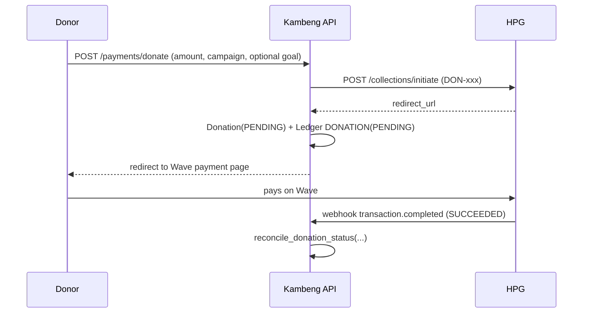

# How Money Flows Through Kambeng

_A deep dive into every path money takes through the platform: donations in, withdrawals out, platform commissions, the ledger that records it all, and the reconciliation machinery that keeps the three in agreement. Written 2026-07-12 against the `development` branch._

---

## 1. The cast

| Actor | Role |
|---|---|
| **Donor** | Gives money to a campaign. Needs no account — quick-pay is anonymous-friendly. |
| **Organizer** | Owns campaigns, withdraws raised funds to their Wave account. Must be KYC-approved to withdraw. |
| **Admin** | Reconciles stuck payments, manages payouts, withdraws platform commissions. |
| **HexAI Payment Gateway (HPG)** | The money rail. Handles Wave mobile-money **collections** (donations in) and **payouts** (withdrawals out). Charges a fee on both directions. |
| **Stripe** | Secondary rail for card donations. |
| **Wave** | The mobile-money wallet where organizers actually receive funds. Kambeng never touches it directly — HPG does. |

Money never sits in a Kambeng-controlled account per se: donations land in the platform's HPG wallet, and withdrawals are paid out of it. The database tracks **claims** on that wallet.

## 2. Fee structure

All fees are configured in [backend/app/core/config.py](../backend/app/core/config.py) via environment variables:

| Setting | Default | Applied |
|---|---|---|
| `HEXAI_COLLECTION_FEE_PERCENT` | 2% | Deducted by HPG from every successful **donation** before it lands in the platform wallet |
| `HEXAI_WITHDRAWAL_FEE_PERCENT` | 2% | Deducted from every **withdrawal** (organizer and admin-commission alike) |
| `PLATFORM_FIXED_COMMISSION_GMD` | D10 | Kambeng's flat commission per organizer withdrawal — this is the platform's revenue |
| `ADMIN_COMMISSION_WAVE_NUMBER` | — | Destination Wave account for platform commission withdrawals (falls back to the requesting admin's number) |

**Worked example — donor gives D1,000; organizer later withdraws it:**

```
Donor pays ...................... 1,000.00 GMD
HPG collection fee (2%) ........... -20.00
Credited to campaign ............... 980.00   ← amount_raised increases by this

Organizer withdraws gross ......... 980.00
HPG withdrawal fee (2%) ........... -19.60
Kambeng commission (flat) ......... -10.00
Organizer receives on Wave ........ 950.40
Kambeng earns ....................... 10.00
```

## 3. Reference prefixes — how transactions are routed

Every external transaction carries a `client_reference` whose **prefix determines how webhooks and reconciliation route it**:

| Prefix | Meaning | Created by |
|---|---|---|
| `DON-` | One-time donation | `POST /payments/donate` |
| `REC-` | Recurring-donation charge | Scheduler worker (`recurring_charge_service`) |
| `PAYOUT-` | Organizer withdrawal | `POST /payments/withdraw` (also legacy `POST /campaigns/{slug}/withdraw`) |
| `OUT-` | Organizer withdrawal (older format, still recognized) | historical |
| `ADMIN-COMM-` | Platform commission withdrawal | `POST /admin/commissions/withdraw` |

## 4. Flow 1 — One-time donation (Wave via HPG)

**Code path:** [payments.py `POST /payments/donate`](../backend/app/api/routes/payments.py) → [hexai_service.initiate_donation](../backend/app/services/hexai_service.py) → resolution via [payment_reconciliation.reconcile_donation_status](../backend/app/services/payment_reconciliation.py)



Step by step:

1. **Initiate.** The API asks HPG for a collection session *first*; only if HPG accepts does it write a `Donation` row (`status=PENDING`, optionally attributed to a `CampaignGoal` via `goal_id`) and a mirrored `TransactionLedger` row (`DONATION`, `PENDING`, gross = net at this point since fees aren't known to be owed until success).
2. **Donor pays** on the Wave page HPG returned. Kambeng is not in that loop.
3. **Resolution.** Exactly one of four paths finalizes the donation — all of them funnel through `reconcile_donation_status`, which is the **only** function allowed to move donation money state:
   - **Webhook** (`POST /webhooks/hexai`, HMAC-verified against `HEXAI_WEBHOOK_SECRET`): `DON-`/`REC-` references with a terminal status.
   - **Client poll** (`GET /payments/donations/{ref}/status`): the payment success page polls; if the donation is still PENDING the API asks HPG's `collections/status/{ref}` directly and reconciles on the spot (source `WEBHOOK`, reason `hexai_poll_confirmed`). This covers lost webhooks.
   - **Stripe confirm** (see Flow 2).
   - **Manual admin** (`POST /payments/admin/donations/{ref}/approve|reject`): audited via `DONATION_MANUAL_APPROVED`.

**What `reconcile_donation_status` guarantees** (all under `SELECT ... FOR UPDATE`):

- **Idempotent**: re-delivering the same terminal status is a no-op.
- **Conflict-safe**: a donation already finalized as `SUCCEEDED` cannot flip to `FAILED` (raises `DonationTransitionConflictError`) — no source can overwrite another.
- On success it computes the HPG collection fee, stores `hexai_fee`/`net_amount` on the ledger row, and **credits `campaign.amount_raised` with the NET amount** (D980 of a D1,000 gift). Goal progress (`goal.amount_raised`) gets the same net credit, and a `TARGET`-mode campaign auto-`CLOSED`s when it reaches its target.
- Ledger row is flipped to `SUCCEEDED`/`FAILED` with reconciliation metadata (source, reason, admin, timestamp).

> **Key invariant:** `campaign.amount_raised` is always **net of collection fees** — it represents money that actually exists in the platform's HPG wallet, which is what makes the withdrawal balance math in §6 sound.

## 5. Flow 2 — Card donation (Stripe)

**Code path:** [payments.py `/payments/stripe/create-payment-intent` and `/payments/stripe/confirm`](../backend/app/api/routes/payments.py)

Same `Donation` + ledger rows as Flow 1, different rail: the frontend creates a Stripe PaymentIntent, the donor pays by card, then the frontend calls `/stripe/confirm`. The server **retrieves the PaymentIntent from Stripe server-side** (never trusts the client) and only reconciles to `SUCCEEDED` (source `STRIPE`) if Stripe itself says `succeeded`. From there it's the same `reconcile_donation_status` machinery — same net-credit, same idempotency.

## 6. Flow 3 — Recurring donations

**Code path:** [scheduler_worker](../backend/app/workers/scheduler_worker.py) → [recurring_charge_service.process_recurring_charges](../backend/app/services/recurring_charge_service.py), daily at 02:00 UTC

Recurring donations are **donor-initiated, not auto-charged** — Wave has no card-on-file equivalent here:

1. Donor sets up a plan (`POST /payments/donations/recurring`: amount, frequency WEEKLY/MONTHLY/QUARTERLY/ANNUAL, anchor date).
2. Each night the worker finds plans with `next_charge_date <= today`, and for each: creates an HPG collection session (`REC-` reference), inserts a PENDING `Donation` + ledger row, and **emails the donor a payment link**.
3. If the donor pays, the normal donation resolution (Flow 1, step 3) takes over.
4. `next_charge_date` advances regardless of whether the donor pays — an unpaid link simply expires as a PENDING donation.
5. If the campaign went inactive, the plan is auto-deactivated instead of charged.

> The worker runs **only** in the dedicated worker container. It was previously also scheduled in the API process, which double-created charge sessions and dunning emails — fixed by consolidating all jobs into `scheduler_worker.py`.

## 7. Flow 4 — Organizer withdrawal (payout)

**Code path:** [payments.py `POST /payments/withdraw`](../backend/app/api/routes/payments.py) → [hexai_service.initiate_payout](../backend/app/services/hexai_service.py) → resolution via [payout_service.apply_payout_status](../backend/app/services/payout_service.py)

### Preconditions and balance math

1. **KYC gate**: `current_user.kyc_status == "APPROVED"` or 403.
2. **Ownership**: only the campaign owner.
3. **Balance**: `available = campaign.amount_raised − Σ net_amount of SUCCEEDED payouts`. Because `amount_raised` is already net of collection fees and we subtract *net* payout amounts, this equals what genuinely remains in the HPG wallet for this campaign. PENDING payouts do **not** reduce the balance (see §10, gap 3).
4. **Fees**: `net = gross − 2% HPG fee − D10 platform commission`; rejected if net ≤ 0.

### Execution order (deliberate)

HPG's `payouts/send` is called **before** anything is written to the DB — if the gateway rejects, no orphan rows. On acceptance:

- `Payout` row: `PAYOUT-<ms-timestamp>`, full fee breakdown, `status=PENDING`
- `TransactionLedger` row: `WITHDRAWAL`, `PENDING`, same breakdown
- "Withdrawal initiated" email to the organizer

### Resolution — four paths, one function

All payout state changes go through `payout_service.apply_payout_status` (idempotent; sends the confirmed/failed email to the organizer; logs every transition with its source):

| Path | Trigger | Source tag |
|---|---|---|
| **Webhook** | HPG notifies. Matched by `PAYOUT-`/`OUT-`/`ADMIN-COMM-` prefix on **any** event name; body parsed leniently (transaction under `transaction`/`payout`/`data` or top-level); status wording normalized (`SUCCESS`, `COMPLETED`, `PAID` → SUCCEEDED; `CANCELLED`, `REJECTED`, `EXPIRED`, … → FAILED) | `WEBHOOK` |
| **Owner poll** | `GET /payments/withdraw/status/{ref}` — the dashboard polls; if PENDING, asks HPG `payouts/status/{ref}` directly and reconciles | poll |
| **Admin verify** (guard rail 1) | `POST /admin/payouts/{id}/verify` — "Verify with HPG" button on `/admin/payouts`; fetches the gateway's real status and applies it if terminal | `VERIFY` |
| **Manual override** (guard rail 2) | `POST /admin/payouts/{id}/mark-succeeded` — "Mark paid" button; **only** PENDING→SUCCEEDED (409 otherwise), written to the admin audit log as `PAYOUT_MANUAL_OVERRIDE` | `MANUAL` |

> History note: payout webhooks were effectively unhandled until 2026-07-11 — a strict body schema 422-rejected nonstandard shapes before logging, only one event name was matched, and only exact-uppercase statuses counted. That's why payouts sat PENDING for weeks; the guard rails exist so a lost webhook can never strand money state again.

## 8. Flow 5 — Platform commissions

**Where revenue comes from:** the flat D10 `platform_commission` on each successful organizer withdrawal. It is *not* moved anywhere at withdrawal time — it simply stays in the platform's HPG wallet because the organizer only received `net`.

**Accounting** ([admin.py `GET /admin/commissions`](../backend/app/api/routes/admin.py)):

```
earned     = Σ platform_commission over SUCCEEDED campaign payouts (campaign_id NOT NULL)
withdrawn  = Σ platform_commission over SUCCEEDED admin payouts   (campaign_id IS NULL)
pending    = Σ platform_commission over PENDING  admin payouts    (campaign_id IS NULL)
available  = earned − withdrawn − pending
```

**Withdrawal** (`POST /admin/commissions/withdraw`): validates against `available`, sends via HPG (minus the 2% payout fee) to `ADMIN_COMMISSION_WAVE_NUMBER`, records a `Payout` with `campaign_id=NULL` and reference `ADMIN-COMM-…`, audit-logs `COMMISSION_WITHDRAWAL_INITIATED`, and resolves through the exact same four payout paths as Flow 4 (the `ADMIN-COMM-` prefix is in the webhook's payout matcher).

## 9. The three books

Money state lives in three places that must agree:

| Book | Table | What it answers |
|---|---|---|
| **Operational** | `donations`, `payouts` | "What is the state of this specific transaction?" Drives UI, webhooks, reconciliation. |
| **Aggregate** | `campaigns.amount_raised`, `campaign_goals.amount_raised` | "How much has this campaign raised (net)?" Drives progress bars and withdrawal balances. Only ever mutated by `reconcile_donation_status`. |
| **Audit** | `transaction_ledgers` | "Every money movement with its fee breakdown." Drives admin reports and `total_platform_revenue` in `/admin/system/stats`. |

Supporting records: `admin_audit_logs` (manual approvals/overrides/commission withdrawals) and structured logs (every transition carries `action`, `client_reference`, source).

`scripts/reconcile_campaign_totals.py` can audit `amount_raised` against the donation history when drift is suspected.

## 10. Known gaps and sharp edges

Ordered by risk. These are documented findings, not yet fixed:

1. **Legacy withdrawal endpoint skips every safeguard.** `POST /campaigns/{slug}/withdraw` ([campaigns.py](../backend/app/api/routes/campaigns.py)) initiates a real HPG payout with **no KYC check, no available-balance check, and no ledger entry**. A non-KYC organizer — or one who already withdrew everything — could pull money out through it. It predates `/payments/withdraw` and should be deleted or made a thin proxy.
2. **Ledger rows go stale on webhook/verify/manual payout resolution.** `apply_payout_status` updates the `Payout` but not the matching `WITHDRAWAL` ledger row; only the owner-poll path updates the ledger. Consequence: `total_platform_revenue` in `/admin/system/stats` (which sums **ledger** rows with `status=SUCCEEDED`) undercounts, while `/admin/commissions` (which sums the **payouts** table) is correct — the two admin screens can disagree. Fix: update the ledger inside `apply_payout_status`.
3. **PENDING payouts don't reserve balance.** Available balance only subtracts SUCCEEDED payouts, so an organizer can fire two quick withdrawals that together exceed their balance — both go to HPG. Fix: include PENDING payouts in `total_net_withdrawn`, releasing the reservation on FAILED.
4. **Commission double-spend window.** Same shape as (3) but narrower: `available_commissions` does subtract pending admin withdrawals, but two concurrent requests can both pass validation before either row commits (no lock around read-then-write).
5. **Unpaid recurring links accumulate as PENDING donations** with PENDING ledger rows, indistinguishable at a glance from payment failures. Consider expiring them after N days.
6. **Fee assumptions are config, not contract.** The 2% figures mirror what HPG currently charges. If HPG changes its fee and the env vars don't move in lockstep, `amount_raised` silently drifts from wallet reality. The reconciliation script is the safety net.

## 11. Quick reference — where to look when money misbehaves

| Symptom | First stop |
|---|---|
| Donation paid but campaign total didn't move | `GET /payments/donations/{ref}/status` (self-heals via HPG poll), then `/admin/donations/pending` → manual approve |
| Payout stuck PENDING | `/admin/payouts` → **Verify with HPG**, then **Mark paid** if confirmed out-of-band |
| Campaign total looks wrong | `scripts/reconcile_campaign_totals.py` (dry-run by default) |
| Revenue numbers disagree between admin screens | Known gap #2 above — trust `/admin/commissions` (payouts table) over `/admin/system/stats` (ledger) |
| Webhook signature failures in logs | `HEXAI_WEBHOOK_SECRET` mismatch; check `sig_preview` in the `hexai_webhook_invalid_signature` log entries |
