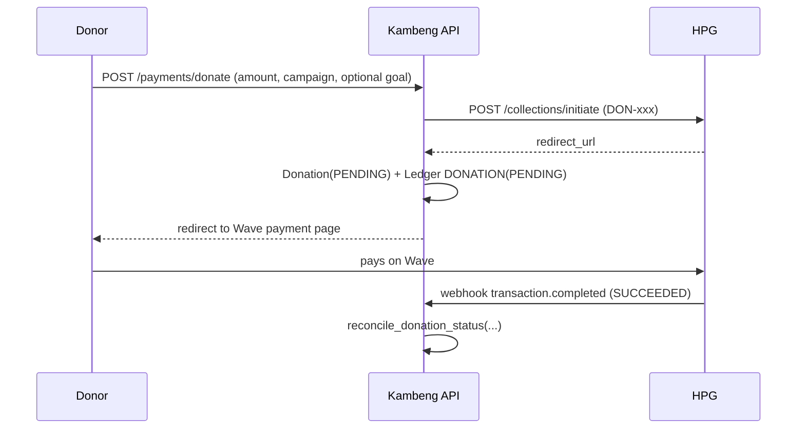

# How Money Flows Through Kambeng

_A deep dive into every path money takes through the platform: donations in, withdrawals out, platform commissions, the ledger that records it all, and the reconciliation machinery that keeps the three in agreement. Written 2026-07-12 against the `development` branch._

---

## 1. The cast

| Actor | Role |
|---|---|
| **Donor** | Gives money to a campaign. Needs no account — quick-pay is anonymous-friendly. |
| **Organizer** | Owns campaigns, withdraws raised funds to their Wave account. Must be KYC-approved to withdraw. |
| **Admin** | Reconciles stuck payments, manages payouts, withdraws platform commissions. |
| **HexAI Payment Gateway (HPG)** | The money rail. Handles Wave mobile-money **collections** (donations in) and **payouts** (withdrawals out). Charges a fee on both directions. |
| **Stripe** | Secondary rail for card donations. |
| **Wave** | The mobile-money wallet where organizers actually receive funds. Kambeng never touches it directly — HPG does. |

Money never sits in a Kambeng-controlled account per se: donations land in the platform's HPG wallet, and withdrawals are paid out of it. The database tracks **claims** on that wallet.

## 2. Fee structure

All fees are configured in [backend/app/core/config.py](../backend/app/core/config.py) via environment variables:

| Setting | Default | Applied |
|---|---|---|
| `HEXAI_COLLECTION_FEE_PERCENT` | 2% | Deducted by HPG from every successful **mobile-money donation** (Wave, APS) before it lands in the platform wallet |
| `HEXAI_CARD_COLLECTION_FEE_PERCENT` | 6% | The same, for **card donations** — these run over Waychit, which carries the card schemes' own cut |
| `HEXAI_WITHDRAWAL_FEE_PERCENT` | 2% | Deducted from every **withdrawal** (organizer and admin-commission alike), rounded **up** to the dalasi |
| `HEXAI_MINIMUM_WITHDRAWAL_FEE_GMD` | D2 | Floor on that fee — 2% works out at D2 per D100, and anything below D100 is still charged D2 |
| `PLATFORM_FIXED_COMMISSION_GMD` | D10 | Kambeng's flat commission per organizer withdrawal, per the TOR — this is the platform's revenue |
| `MINIMUM_DONATION_GMD` | D10 | Smallest donation the API accepts (one-off and recurring) |
| `ADMIN_COMMISSION_WAVE_NUMBER` | — | Destination Wave account for platform commission withdrawals (falls back to the requesting admin's number) |

The rate is the **rail's**, not a flat platform number: [fees.py](../backend/app/services/fees.py) picks it from `Donation.provider`, so a D1,000 card gift credits D940 where the same gift over Wave credits D980. Charging card donations at 2% credited each campaign 4% that never reached the wallet — see the backfill note in §12.

### Whole dalasi, always

Kambeng deals in whole dalasi. Nothing in the system stores, sends or displays bututs, because the payment rail refuses payouts that carry them (D134.06 is rejected where D134.00 settles — HPG integration notice, 20 Sep 2026) and a balance the rail can't pay out is not a balance.

[money.py](../backend/app/services/money.py) is the single place that decides how:

| Rule | Direction | Why |
|---|---|---|
| Amounts entering the API (donations, recurring plans, withdrawals, campaign and goal targets) | rejected if fractional (422) | the person typing it should hear about it, not discover a silent rounding later |
| Credits, payouts, balances (`floor_dalasi`) | **down** | a balance is never larger than the money behind it |
| Collection fees (`floor_dalasi`) | **down** | nobody is charged for bututs they can't see |
| HPG's payout fee (`ceil_dalasi`, D2 floor) | **up** | this is what HPG bills us; recording less would leave the wallet short |
| Payout remainder (`split_whole_dalasi`) | carried forward | a sub-dalasi remainder stays in the balance for the next withdrawal — never dropped |

Because gross amounts arrive whole and every fee is whole, `gross == net + fees` holds exactly in whole dalasi. All arithmetic runs on integer bututs internally (`0.1 + 0.2` is not `0.3`).

**What flooring collection fees costs.** HPG's real cut on a donation is a percentage, so it can exceed the whole dalasi we record — by at most 99 bututs per donation (2% of D125 is D2.50; we record D2). The campaign is credited that difference, which means `campaign.amount_raised` can run marginally ahead of the HPG wallet. That gap is the platform's to absorb out of its D10 commissions, and `build_campaign_amount_reconciliation` is what measures it. It is bounded per transaction, not per dalasi, so it matters most on many small donations — which is part of why there's a minimum. Payouts carry no such gap: their fee is recorded exactly as billed.

### Minimum donation

`MINIMUM_DONATION_GMD` (default **D10**) is the smallest donation the API accepts, on one-off donations and recurring plans alike ([app/schemas/money.py](../backend/app/schemas/money.py)). Below it the rail's cut and the per-transaction overhead swallow the gift. The recurring worker applies the same floor: a legacy plan below the minimum is skipped with a `recurring_charge_below_minimum` warning rather than charged.

**Worked example — donor gives D1,000; organizer later withdraws it:**

```
Donor pays ...................... 1,000.00 GMD
HPG collection fee (2%) ........... -20.00
Credited to campaign ............... 980.00   ← amount_raised increases by this

Organizer withdraws gross ......... 980.00
HPG withdrawal fee (2%) ........... -19.60
Kambeng commission (flat) ......... -10.00
Organizer receives on Wave ........ 950.40
Kambeng earns ....................... 10.00
```

## 3. Reference prefixes — how transactions are routed

Every external transaction carries a `client_reference` whose **prefix determines how webhooks and reconciliation route it**:

| Prefix | Meaning | Created by |
|---|---|---|
| `DON-` | One-time donation | `POST /payments/donate` |
| `REC-` | Recurring-donation charge | Scheduler worker (`recurring_charge_service`) |
| `PAYOUT-` | Organizer withdrawal | `POST /payments/withdraw` (the only withdrawal endpoint — a legacy unguarded one was removed 2026-07-12) |
| `OUT-` | Organizer withdrawal (older format, still recognized) | historical |
| `ADMIN-COMM-` | Platform commission withdrawal | `POST /admin/commissions/withdraw` |

## 4. Flow 1 — One-time donation (Wave via HPG)

**Code path:** [payments.py `POST /payments/donate`](../backend/app/api/routes/payments.py) → [hexai_service.initiate_donation](../backend/app/services/hexai_service.py) → resolution via [payment_reconciliation.reconcile_donation_status](../backend/app/services/payment_reconciliation.py)



Step by step:

1. **Initiate.** The API asks HPG for a collection session *first*; only if HPG accepts does it write a `Donation` row (`status=PENDING`, optionally attributed to a `CampaignGoal` via `goal_id`, and linked to the donor's account via `user_id` when they're logged in — anonymous quick-pay stays unlinked) and a mirrored `TransactionLedger` row (`DONATION`, `PENDING`, gross = net at this point since fees aren't known to be owed until success). Linked donations power the donor's giving history at `GET /payments/donations/me`.
2. **Donor pays** on the Wave page HPG returned. Kambeng is not in that loop.
3. **Resolution.** Exactly one of four paths finalizes the donation — all of them funnel through `reconcile_donation_status`, which is the **only** function allowed to move donation money state:
   - **Webhook** (`POST /webhooks/hexai`, HMAC-verified against `HEXAI_WEBHOOK_SECRET`): `DON-`/`REC-` references with a terminal status.
   - **Client poll** (`GET /payments/donations/{ref}/status`): the payment success page polls; if the donation is still PENDING the API asks HPG's `collections/status/{ref}` directly and reconciles on the spot (source `WEBHOOK`, reason `hexai_poll_confirmed`). This covers lost webhooks.
   - **Stripe confirm** (see Flow 2).
   - **Manual admin** (`POST /payments/admin/donations/{ref}/approve|reject`): audited via `DONATION_MANUAL_APPROVED`.

**What `reconcile_donation_status` guarantees** (all under `SELECT ... FOR UPDATE`):

- **Idempotent**: re-delivering the same terminal status is a no-op.
- **Conflict-safe**: a donation already finalized as `SUCCEEDED` cannot flip to `FAILED` (raises `DonationTransitionConflictError`) — no source can overwrite another.
- On success it computes the HPG collection fee **at the rate for that donation's rail** (2% mobile money, 6% card), stores `hexai_fee`/`net_amount` on the ledger row, and **credits `campaign.amount_raised` with the NET amount** — D980 of a D1,000 Wave gift, D940 of the same gift by card, both whole dalasi. Goal progress (`goal.amount_raised`) gets the same net credit, and a `TARGET`-mode campaign auto-`CLOSED`s when it reaches its target.
- Ledger row is flipped to `SUCCEEDED`/`FAILED` with reconciliation metadata (source, reason, admin, timestamp).

> **Key invariant:** `campaign.amount_raised` is always **net of collection fees** — it represents money that actually exists in the platform's HPG wallet, which is what makes the withdrawal balance math in §6 sound.

## 5. Flow 2 — Card donation (Stripe)

**Code path:** [payments.py `/payments/stripe/create-payment-intent` and `/payments/stripe/confirm`](../backend/app/api/routes/payments.py)

Same `Donation` + ledger rows as Flow 1, different rail: the frontend creates a Stripe PaymentIntent, the donor pays by card, then the frontend calls `/stripe/confirm`. The server **retrieves the PaymentIntent from Stripe server-side** (never trusts the client) and only reconciles to `SUCCEEDED` (source `STRIPE`) if Stripe itself says `succeeded`. From there it's the same `reconcile_donation_status` machinery — same net-credit, same idempotency.

## 6. Flow 3 — Recurring donations

**Code path:** [scheduler_worker](../backend/app/workers/scheduler_worker.py) → [recurring_charge_service.process_recurring_charges](../backend/app/services/recurring_charge_service.py), daily at 02:00 UTC

Recurring donations are **donor-initiated, not auto-charged** — Wave has no card-on-file equivalent here:

1. Donor sets up a plan (`POST /payments/donations/recurring`: amount, frequency WEEKLY/MONTHLY/QUARTERLY/ANNUAL, anchor date).
2. Each night the worker finds plans with `next_charge_date <= today`, and for each: creates an HPG collection session (`REC-` reference), inserts a PENDING `Donation` + ledger row, and **emails the donor a payment link**.
3. If the donor pays, the normal donation resolution (Flow 1, step 3) takes over.
4. `next_charge_date` advances regardless of whether the donor pays — an unpaid link simply expires as a PENDING donation.
5. If the campaign went inactive, the plan is auto-deactivated instead of charged.

> The worker runs **only** in the dedicated worker container. It was previously also scheduled in the API process, which double-created charge sessions and dunning emails — fixed by consolidating all jobs into `scheduler_worker.py`.

## 7. Flow 4 — Organizer withdrawal (payout)

**Code path:** [payments.py `POST /payments/withdraw`](../backend/app/api/routes/payments.py) → [hexai_service.initiate_payout](../backend/app/services/hexai_service.py) → resolution via [payout_service.apply_payout_status](../backend/app/services/payout_service.py)

### Preconditions and balance math

1. **KYC gate**: `current_user.kyc_status == "APPROVED"` or 403.
2. **Ownership**: only the campaign owner.
3. **Balance**: `available = campaign.amount_raised − Σ net of SUCCEEDED payouts − Σ net of PENDING payouts`. Because `amount_raised` is already net of collection fees and we subtract *net* payout amounts, this equals what genuinely remains in the HPG wallet for this campaign. PENDING payouts reserve their amount (they're already in flight at the gateway); a FAILED payout releases its hold.
4. **Fees**: `net = gross − HPG fee − D10 Kambeng commission`, where the HPG fee is 2% rounded up with a D2 floor (D2 on anything up to D100, D3 at D101, D20 at D1,000) and the D10 is Kambeng's flat commission per the TOR. Rejected if net < D1, so the practical minimum withdrawal is D13.
5. **Whole dalasi**: the payment rail refuses any payout carrying butut precision — D134.06 is rejected where D134.00 settles (HPG integration notice, 20 Sep 2026; it is what made the 16 Sep payout fail ~30s after a `200 PROCESSING` with an unhelpful `Request invalid`). The net is therefore floored to a whole dalasi via [`money.split_whole_dalasi`](../backend/app/services/money.py), and the sub-dalasi remainder is subtracted from the recorded `gross_amount` so it stays in the campaign's available balance for the next withdrawal — never rounded up (which would pay out money the balance doesn't back), never dropped (which would lose the organizer's money a few bututs at a time). `initiate_payout` re-checks this and raises `amount_not_whole` (400) rather than letting a fractional amount reach the rail; the endpoint surfaces any gateway 4xx as a 400, since resending it unchanged cannot succeed.

### Execution order (deliberate)

HPG's `payouts/send` is called **before** anything is written to the DB — if the gateway rejects, no orphan rows. On acceptance:

- `Payout` row: `PAYOUT-<ms-timestamp>`, full fee breakdown, `status=PENDING`
- `TransactionLedger` row: `WITHDRAWAL`, `PENDING`, same breakdown
- "Withdrawal initiated" email to the organizer

### Resolution — four paths, one function

All payout state changes go through `payout_service.apply_payout_status` (idempotent; updates the matching `WITHDRAWAL` ledger row in the same commit; sends the confirmed/failed email to the organizer; logs every transition with its source):

| Path | Trigger | Source tag |
|---|---|---|
| **Webhook** | HPG notifies. Matched by `PAYOUT-`/`OUT-`/`ADMIN-COMM-` prefix on **any** event name; body parsed leniently (transaction under `transaction`/`payout`/`data` or top-level); status wording normalized (`SUCCESS`, `COMPLETED`, `PAID`, `DELIVERED` → SUCCEEDED; `CANCELLED`, `REJECTED`, `EXPIRED`, … → FAILED) | `WEBHOOK` |
| **Owner poll** | `GET /payments/withdraw/status/{ref}` — the dashboard polls; if PENDING, asks HPG `payouts/status/{ref}` directly and reconciles | `POLL` |
| **Admin verify** (guard rail 1) | `POST /admin/payouts/{id}/verify` — "Verify with HPG" button on `/admin/payouts`; fetches the gateway's real status and applies it if terminal | `VERIFY` |
| **Manual override** (guard rail 2) | `POST /admin/payouts/{id}/mark-succeeded` — "Mark paid" button; **only** PENDING→SUCCEEDED (409 otherwise), written to the admin audit log as `PAYOUT_MANUAL_OVERRIDE` | `MANUAL` |

> History note: payout webhooks were effectively unhandled until 2026-07-11 — a strict body schema 422-rejected nonstandard shapes before logging, only one event name was matched, and only exact-uppercase statuses counted. That's why payouts sat PENDING for weeks; the guard rails exist so a lost webhook can never strand money state again.

## 8. Flow 5 — Platform commissions

**Where revenue comes from:** the flat D10 `platform_commission` on each successful organizer withdrawal. It is *not* moved anywhere at withdrawal time — it simply stays in the platform's HPG wallet because the organizer only received `net`.

**Accounting** ([admin.py `GET /admin/commissions`](../backend/app/api/routes/admin.py)):

```
earned     = Σ platform_commission over SUCCEEDED campaign payouts (campaign_id NOT NULL)
withdrawn  = Σ platform_commission over SUCCEEDED admin payouts   (campaign_id IS NULL)
pending    = Σ platform_commission over PENDING  admin payouts    (campaign_id IS NULL)
available  = earned − withdrawn − pending
```

**Withdrawal** (`POST /admin/commissions/withdraw`): validates against `available`, sends via HPG (minus the 2% payout fee, floored to a whole dalasi like every payout — the remainder stays in `available_commissions`) to `ADMIN_COMMISSION_WAVE_NUMBER`, records a `Payout` with `campaign_id=NULL` and reference `ADMIN-COMM-…`, audit-logs `COMMISSION_WITHDRAWAL_INITIATED`, and resolves through the exact same four payout paths as Flow 4 (the `ADMIN-COMM-` prefix is in the webhook's payout matcher).

## 9. The three books

Money state lives in three places that must agree:

| Book | Table | What it answers |
|---|---|---|
| **Operational** | `donations`, `payouts` | "What is the state of this specific transaction?" Drives UI, webhooks, reconciliation. |
| **Aggregate** | `campaigns.amount_raised`, `campaign_goals.amount_raised` | "How much has this campaign raised (net)?" Drives progress bars and withdrawal balances. Only ever mutated by `reconcile_donation_status`. |
| **Audit** | `transaction_ledgers` | "Every money movement with its fee breakdown." Drives admin reports and `total_platform_revenue` in `/admin/system/stats`. |

Supporting records: `admin_audit_logs` (manual approvals/overrides/commission withdrawals) and structured logs (every transition carries `action`, `client_reference`, source).

`scripts/reconcile_campaign_totals.py` can audit `amount_raised` against the donation history when drift is suspected.

## 10. Known gaps and sharp edges

Ordered by risk:

1. **Commission double-spend window.** `available_commissions` subtracts pending admin withdrawals, but two concurrent requests can both pass validation before either row commits (no lock around read-then-write).
2. **Unpaid recurring links accumulate as PENDING donations** with PENDING ledger rows, indistinguishable at a glance from payment failures. Consider expiring them after N days.
3. **Fee assumptions are config, not contract.** The 2% and 6% figures mirror what HPG currently charges. If HPG changes a rate and the env vars don't move in lockstep, `amount_raised` silently drifts from wallet reality. The reconciliation script is the safety net.

**Fixed 2026-07-12** (kept here for history):

- ~~Legacy `POST /campaigns/{slug}/withdraw` skipped KYC, balance check, and ledger~~ — endpoint deleted; `/payments/withdraw` is the only withdrawal path, and a regression test asserts the old route stays dead.
- ~~Ledger rows went stale on webhook/verify/manual payout resolution~~ — `apply_payout_status` now updates the `WITHDRAWAL` ledger row in the same commit, and the owner-poll endpoint routes through the same service instead of duplicating the logic.
- ~~PENDING payouts didn't reserve balance~~ — in-flight payouts now reduce `available_balance`; FAILED releases the hold.

## 11. Quick reference — where to look when money misbehaves

| Symptom | First stop |
|---|---|
| Donation paid but campaign total didn't move | `GET /payments/donations/{ref}/status` (self-heals via HPG poll), then `/admin/donations/pending` → manual approve |
| Payout stuck PENDING | `/admin/payouts` → **Verify with HPG**, then **Mark paid** if confirmed out-of-band |
| Campaign total looks wrong | `scripts/reconcile_campaign_totals.py` (dry-run by default), then `scripts/recompute_whole_dalasi_totals.py` to re-record at the right rail fee |
| Revenue numbers disagree between admin screens | Ledger rows resolved before 2026-07-12 may still be PENDING (the sync fix isn't retroactive) — reconcile old `WITHDRAWAL` ledger rows against the payouts table |
| Webhook signature failures in logs | `HEXAI_WEBHOOK_SECRET` mismatch; check `sig_preview` in the `hexai_webhook_invalid_signature` log entries |

## 12. Correcting the historical record

Two rules arrived after money had already moved, so the stored data predates them:

- **Card donations were recorded at 2%** instead of Waychit's 6%. Every card donation credited its campaign roughly 4% that never landed in the HPG wallet — a claim on money that isn't there, which surfaces as a payout the wallet can't cover.
- **Amounts carried bututs**, from percentage fees applied to fractional values.

[`scripts/recompute_whole_dalasi_totals.py`](../backend/scripts/recompute_whole_dalasi_totals.py) re-records every settled donation under its own rail's rate, in whole dalasi: it recomputes `campaign.amount_raised`, each `CampaignGoal.amount_raised`, and the `hexai_fee`/`net_amount` on the matching `DONATION` ledger rows. It is **dry-run by default** and prints every delta plus how much of the total is the card-rate correction; `--apply` commits.

One caveat before applying: promotional credits (matched donations, rebates, absorbed fees) are not part of the donation sum, so a campaign that received them will legitimately show a higher `amount_raised` than the script computes. Read the deltas against `promo_applications` before committing on a database where promos have run.
