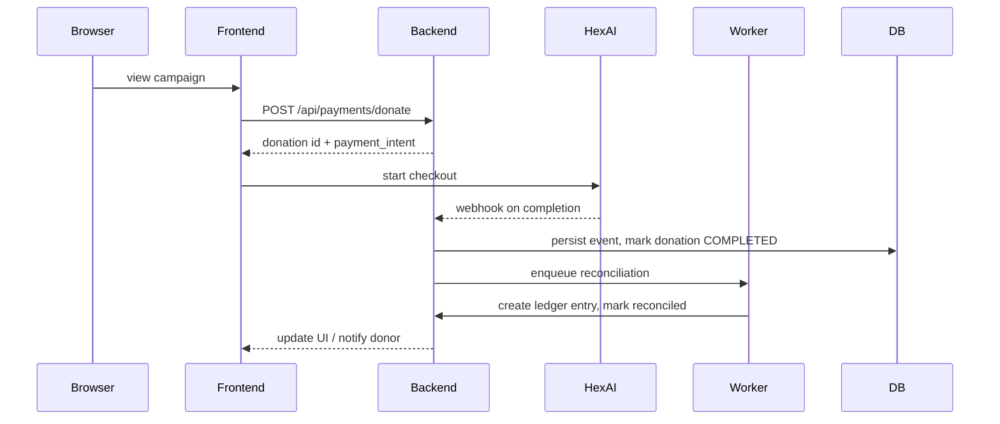
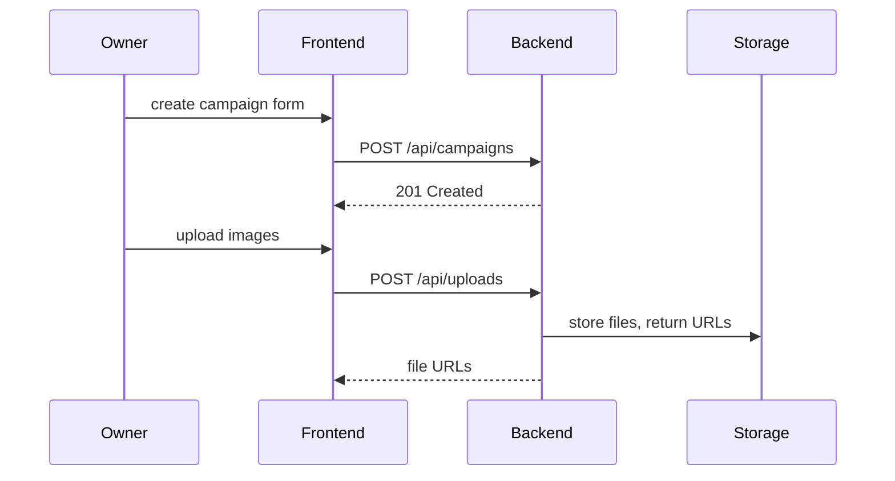

# Project Overview

## 1. Executive Summary
Kambeng is a community-powered crowdfunding platform for Gambian communities. It enables campaign creation, goal-based fundraising, secure donations, proof-of-expenditure tracking, and administrative moderation to ensure transparency and trust.

## 2. Problem Statement
Many local fundraisers lack a lightweight, auditable platform that supports goal-based campaigns, KYC verification, and transparent expenditure proofing. This leads to poor accountability, donor mistrust, and manual reconciliation overhead for organisers.

## 3. Solution Overview
Kambeng provides an integrated web app (Next.js frontend + FastAPI backend) that:
- Lets organisers create and manage campaigns and milestones.
- Accepts payments via HexAI and records transactions in a transaction ledger.
- Supports KYC submissions and admin moderation workflows.
# Project Overview

## 1. Executive Summary
Kambeng is a community-powered crowdfunding platform tailored for Gambian communities. It enables campaign creation, goal-based fundraising, secure donations, proof-of-expenditure tracking, KYC verification, and administrative moderation to ensure transparency, auditability, and trust between donors and organisers. Production public endpoints are hosted at https://kambeng.hexai.gm.

## 2. Research & Validation
- User research summary: interviews with target organisers highlighted needs for simple campaign setup, milestone tracking, and transparent spending receipts. Donors prioritise clear milestones and verifiable proof for how funds are spent.
- Validation actions taken: seeded demo campaigns, manual playtests of donation flows with HexAI sandbox, and admin usability tests for moderation/KYC flows.
- Key decisions from research: prioritise milestone (goal) support, lightweight KYC for organisers, and an auditable transaction ledger for reconciliation.

## 3. Problem Statement
Many local fundraisers lack an auditable platform combining easy campaign creation, milestone-based accountability, accessible payment options within Gambia (HexAI), and a simple KYC/moderation pipeline.

## 4. Solution Overview
Kambeng addresses these problems via a web application (Next.js frontend + FastAPI backend) that: supports milestone goals, integrates HexAI for payments, stores verifiable proofs of expenditure, and provides admin tools for KYC and moderation with full audit trails.

## 5. Technology Stack
- Backend: Python 3.12, FastAPI, SQLAlchemy (async), Alembic
- Database: PostgreSQL
- Frontend: Next.js 16 (App Router), TypeScript, React 19
- State & Data: Zustand, @tanstack/react-query
- Storage: DigitalOcean Spaces (production) or local uploads (dev)
- Payments: HexAI gateway
- Email: Resend (transactional)
- Workers/Scheduler: APScheduler / background worker processes
- Testing: pytest (backend), Playwright (frontend)
- Dev tooling: Docker, Docker Compose, Uvicorn, Turbopack

## 6. System Architecture

High-level topology (Mermaid):

```mermaid
flowchart LR
  subgraph Client
    B[User Browser]
  end

  subgraph Frontend
    FE[Next.js App]
  end

  subgraph Backend
    API[FastAPI API]
    W[Workers / Scheduler]
  end

  DB[(Postgres)]
  Storage[(DO Spaces / Uploads)]
  HexAI[HexAI (payments)]
  Resend[Resend (email)]

  B -->|https://kambeng.hexai.gm| FE
  FE -->|HTTPS API| API
  API --> DB
  API --> Storage
  API --> HexAI
  API --> Resend
  API --> W
  W --> DB
  W --> HexAI
  Storage ---|public URLs| B
```

Narrative: The frontend invokes the backend for campaign management and payment initiation. The backend persists state in Postgres and stores media in DO Spaces. Workers handle reconciliation, recurring donations, and heavy processing tasks. HexAI and Resend are external services for payments and email.

## 7. Database Schema (detailed summary)
Primary tables and notable fields; see `backend/app/models/` for canonical definitions and constraints.

- `users`
  - `id: int (pk)`, `phone_number: str`, `email: str | null`, `full_name: str`, `password_hash: str`, `role`, `kyc_status`, `created_at`, `updated_at`
- `campaigns`
  - `id`, `owner_id -> users.id`, `title`, `slug (unique)`, `description`, `mode`, `target_amount`, `currency`, `status`, `current_amount`, `created_at`
- `campaign_goals`
  - `id`, `campaign_id -> campaigns.id`, `title`, `target_amount`, `current_amount`, `status`, `due_date`, `created_at`
- `donations`
  - `id`, `campaign_id`, `donor_user_id`, `donor_name`, `amount`, `currency`, `status`, `payment_provider`, `provider_charge_id`, `provider_metadata`, `created_at`
- `payment_events` / `transactions`
  - `id`, `donation_id`, `provider`, `provider_event_type`, `raw_payload (jsonb)`, `reconciled: bool`, `created_at`
- `kyc_submissions`
  - `id`, `user_id`, `document_urls (jsonb)`, `status`, `reviewer_id`, `review_notes`, `created_at`
- `uploads`
  - `id`, `owner_id`, `campaign_id`, `file_key`, `public_url`, `storage_provider`, `mime_type`, `size_bytes`, `created_at`
- `ledger_entries`
  - `id`, `transaction_id`, `amount`, `entry_type`, `balance_after`, `note`, `created_at`
- `payouts`
  - `id`, `campaign_id`, `amount`, `payee_details (jsonb)`, `status`, `processed_at`
- `moderation_reports`
  - `id`, `reporter_user_id`, `reported_entity_type`, `reported_entity_id`, `reason`, `description`, `status`, `created_at`

Indexes: PKs on `id`, FKs across relations, unique index on `campaigns.slug`, indices on `created_at` and `status` fields for queries.

## 8. User Flows (sequence diagrams)

Donation flow:



Campaign creation flow:



## 9. Features & Detailed Behaviours

### Goals (milestones)
- Goals allow campaign owners to break targets into accountable steps with independent targets and deadlines.
- Donations may be targeted at a specific goal; otherwise the campaign's allocation rules decide how unallocated funds apply to goals.
- When a goal reaches its `target_amount`, its status flips to `COMPLETED` and an optional notification/email is sent.

Behavioural details:
- Partial funding: a goal can be partially funded; progress percentages are computed as `current_amount / target_amount`.
- Overfunding: excess goes to next active goal or to campaign general balance based on `mode`.
- Administrative actions: owners can pause, extend, or cancel goals; changes are recorded in audit logs.

### Email service (Resend)
- Used for transactional emails: registration, password resets, donation receipts, milestone completion, KYC updates, moderation notices.
- Templates: server-side templates with placeholders; support for i18n keys.
- Reliability: retry on transient failures, log persistent failures, and alert admins on repeated delivery errors.

### KYC
- Accepts PNG, JPG, PDF (default max 10MB). Documents stored privately in DO Spaces.
- Admin reviewers use `/admin/kyc-queue` to inspect presigned URLs and record decisions.
- All KYC actions are audited (reviewer, notes, timestamps).

### Moderation
- Users file reports referencing specific entities; reports include reason and optional evidence (images, messages).
- Admins triage via `/admin/moderation` and can perform actions: remove content, reinstate content, warn/suspend user.
- Every moderation action is logged on the report with a resolution note; financial reversals trigger ledger entries.

## 10. API Documentation
- Production Swagger/OpenAPI (if enabled): https://kambeng.hexai.gm/docs
- Canonical OpenAPI JSON used by the frontend: `frontend-next/openapi.json`

Common endpoints:
- `POST /api/auth/register` — register user
- `POST /api/auth/login` — exchange credentials for access token
- `GET /api/campaigns/` — list campaigns
- `POST /api/campaigns/` — create campaign (auth required)
- `POST /api/payments/donate` — initiate donation
- `POST /api/webhooks/hexai` — receive payment webhooks (verify signature)

Auth: JWT Bearer tokens (OAuth2-like flows); scope and refresh token details in backend docs.

## 11. Application Pages & Routing
- Public pages: `/`, `/campaigns`, `/campaigns/[slug]`, `/donate/[campaign]`
- Dashboard: `/dashboard`, `/dashboard/campaigns`, `/dashboard/campaigns/[id]/edit`
- Admin: `/admin/moderation`, `/admin/kyc-queue`, `/admin/campaigns/[id]/view`

## 12. Deployment
- Host frontend at `https://kambeng.hexai.gm` (CDN + static hosting or Node runtime).
- Host backend at `https://kambeng.hexai.gm/api` behind reverse proxy (Nginx) or API gateway.
- Use Docker Compose for small VPS deployments; consider Kubernetes for larger scale.

Production env vars (checklist): `DATABASE_URL`, `SECRET_KEY`, `HEXAI_API_KEY`, `HEXAI_WEBHOOK_SECRET`, `STORAGE_STRATEGY=do_spaces`, `DO_SPACES_KEY`, `DO_SPACES_SECRET`, `DO_SPACES_BUCKET`, `RESEND_API_KEY`, `BACKEND_PUBLIC_URL`, `FRONTEND_URL`.

Ops notes:
- Use presigned URLs for admin KYC review; restrict public file permissions.
- Rotate keys and monitor reconciliation worker metrics.
- Implement backups and periodic restore drills.

## 13. Future Enhancements
- Multi-currency & exchange-rate handling
- Refund and dispute automation
- Role-based access control with granular permissions
- CI job to publish OpenAPI docs to a docs site
- Analytics and campaign performance dashboard

## 14. Conclusion
Kambeng focuses on making community fundraising transparent and auditable while keeping the user experience simple for organisers and donors. Keep this document updated as the product and operations evolve.

---

References:
- Root README: `README.md`
- Backend runbook: `backend/README.md`
- Frontend notes: `frontend-next/README.md`
- Feature guides: `QR_CODE_FEATURE.md`, `frontend-next/PROOF_INTEGRATION_GUIDE.md`
- Models: `backend/app/models/`

---

References:
- Root README: `README.md`
- Backend runbook: `backend/README.md`
- Frontend notes: `frontend-next/README.md`
- Feature guides: `QR_CODE_FEATURE.md`, `frontend-next/PROOF_INTEGRATION_GUIDE.md`
- Models: `backend/app/models/`